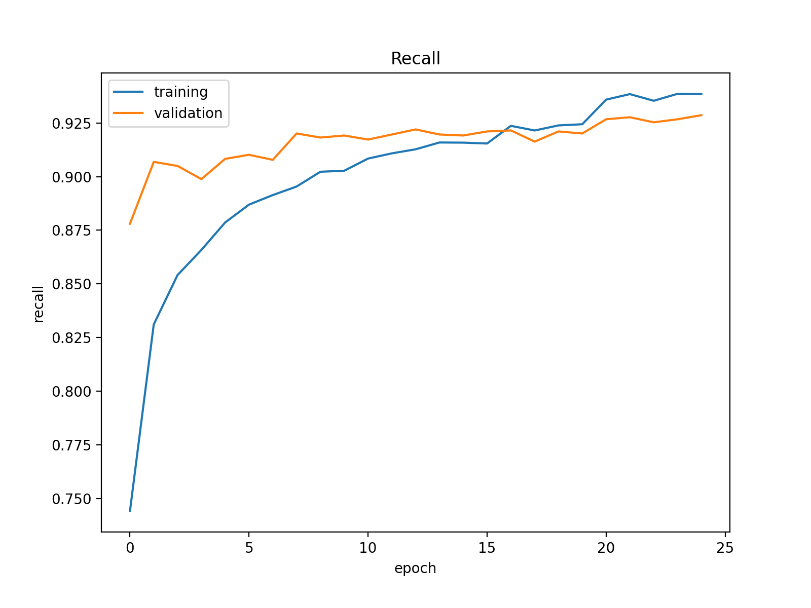
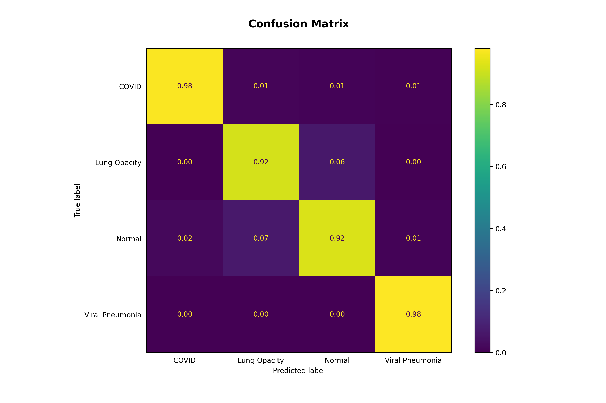

# :lungs: Chest-X-Ray Classification


This project classifies chest X-ray images using a customized DenseNet121 neural network model.

## Contents

- [Technologies](#technologies)
- [Dataset description](#dataset-description)
- [Data preprocessing](#data-preprocessing)
- [Proposed model](#proposed-model)
- [Methodology](#methodology)
- [Results](#results)
- [Requirements](#requirements)
- [Credits](#credits)

## Technologies


## Dataset description

This dataset of chest X-ray (CXR) images was sourced from [Kaggle](https://www.kaggle.com/datasets/tawsifurrahman/covid19-radiography-database).

It contains 3616 COVID, 6012 Lung Opacity, 10192 Normal, and 1345 Viral Pneumonia CXR images.


Every image was PNG, grayscale, and 299 x 299 pixels.


## Data preprocessing

Images were processed using `tf.keras.applications.resnet50.preprocess_input`, which converts images from RGB to BGR
and then zero-centers each color channel with respect to the ImageNet dataset without scaling. The images were also
resized to 224 x 224 for ImageNet compatibility reasons.

In addition, real-time data augmentation was done. The table below details the parameters used.


For visualization purposes, some augmented pictures were saved to aug_images folder via the `save_to_dir` arg.


## Proposed model

New bottleneck layers and a classifier head were added to a pretrained DenseNet121 model.

```python
base_model = DenseNet121(
    include_top=False,
    weights='imagenet',
    input_tensor=Input(shape=(IMG_DIMS, IMG_DIMS, 3)),
    input_shape=(IMG_DIMS, IMG_DIMS, 3))

model = Sequential()
model.add(base_model)
model.add(Flatten())
model.add(BatchNormalization())
model.add(Dense(1024, activation='relu'))
model.add(Dropout(0.4))
model.add(BatchNormalization())
model.add(Dense(512, activation='relu'))
model.add(Dropout(0.4))
model.add(BatchNormalization())
model.add(Dense(256, activation='relu'))
model.add(Dense(4, activation='softmax'))
```

The base model layers were frozen,
resulting in 52,141,828 trainable and 7,140,712 non-trainable parameters.

## Methodology

The table below summarizes the dataset partition details.


Images and were trained for 25 epochs with a learning rate of 1e-4.
The learning rate was lowered to 1e-5 for the last 5 epochs.

## Results

### Training Results




### Testing Results

Output predictions were generated for the test input samples
and  compared to the true label values.

See `sklearn.metrics.classification_report` and `sklearn.metrics.ConfusionMatrixDisplay` for more details.




## Requirements

Third party imports: matplotlib, numpy, IPython, PIL, sklearn, tensorflow, splitfolders

## Credits

- https://www.kaggle.com/datasets/tawsifurrahman/covid19-radiography-database
- https://arxiv.org/pdf/1608.06993.pdf
